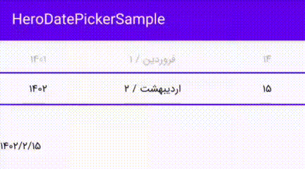

# HeroDatePicker


HeroDatePicker is a customizable date picker component for Android Jetpack Compose that allows users
to easily select Persian (Jalali) dates in a visually appealing way. It features a sleek and modern
design, with smooth animations and intuitive controls.

## Features:

- Support for Persian (Jalali) calendar system
- Customizable date format and locale
- Ability to disable specific dates or date ranges
- Integration with ViewModel for state management
- Easy-to-use API with clear documentation

[](https://jitpack.io/#hamid97m/herodatepicker)

## Setup

### Configure the repositories

`HeroDatePicker` is available through the *JitPack* repository. You can declare this repository in
your build script as follows:

<details open>
<summary>Kotlin DSL</summary>

```kotlin
repositories {
    maven { url = uri("https://jitpack.io") }
}
```

</details>

<details>
<summary>Groovy DSL</summary>

```groovy
repositories {
    maven { url 'https://jitpack.io' }
}
```

</details>

### Add the dependency

After repository configuration, add a dependency on HeroDatePicker to your module's `build.gradle`
file:

<details open>
<summary>Kotlin DSL</summary>

```kotlin
dependencies {
    implementation("com.github.hamid97m:herodatepicker:1.0.0")
}
```

</details>

<details>
<summary>Groovy DSL</summary>

```groovy
dependencies {
    implementation 'com.github.hamid97m:herodatepicker:1.0.0'
}
```

</details>

## Usage

```kotlin
HeroDatePicker(Modifier.fillMaxWidth()) { selectedDate ->
    val (year, month, day) = selectedDate
    println("Selected Date: $year/$month/$day")
}
```

In addition, there is a sample app available in the
project's [sample directory](https://github.com/hamid97m/HeroDatePicker/tree/master/sample) that
demonstrates how to use the library.

<p align="center">

</p>

## Contributing
We welcome contributions from the community! If you find a bug or have a feature request, please open an issue on the GitHub repository. If you'd like to contribute code, please fork the repository and submit a pull request.

## License
HeroDatePicker is licensed under the MIT License.
